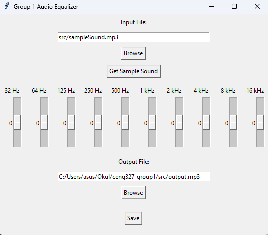

in order to run the code install PyDub:

    pip install pydub

run the code:

    python audio.py

browse for the input file (.mp3, .wav, .flac, .ogg)

also browse for the output file for when the output is created

